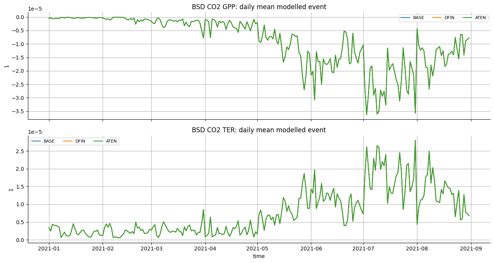
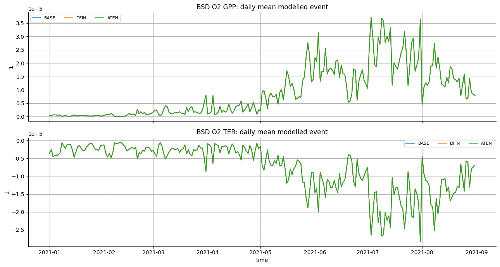
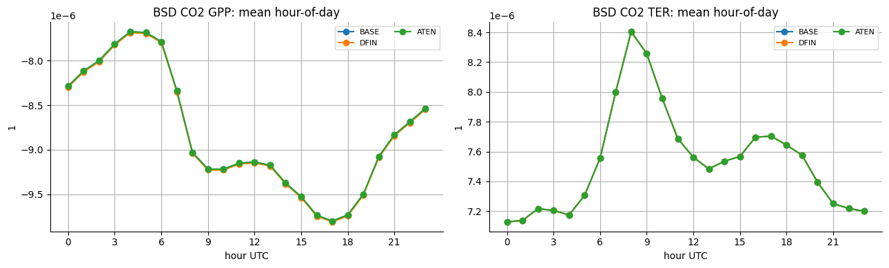
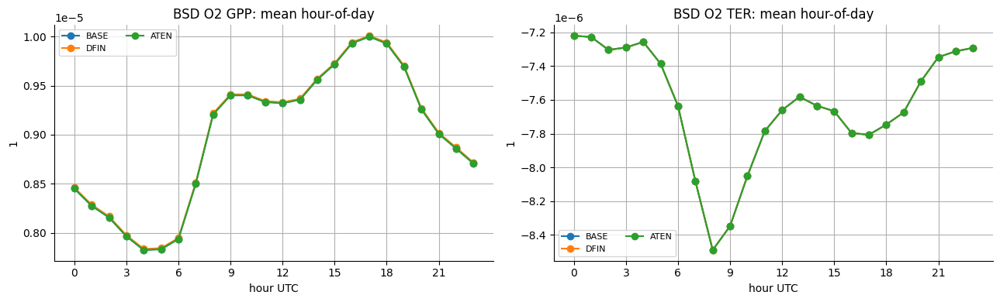
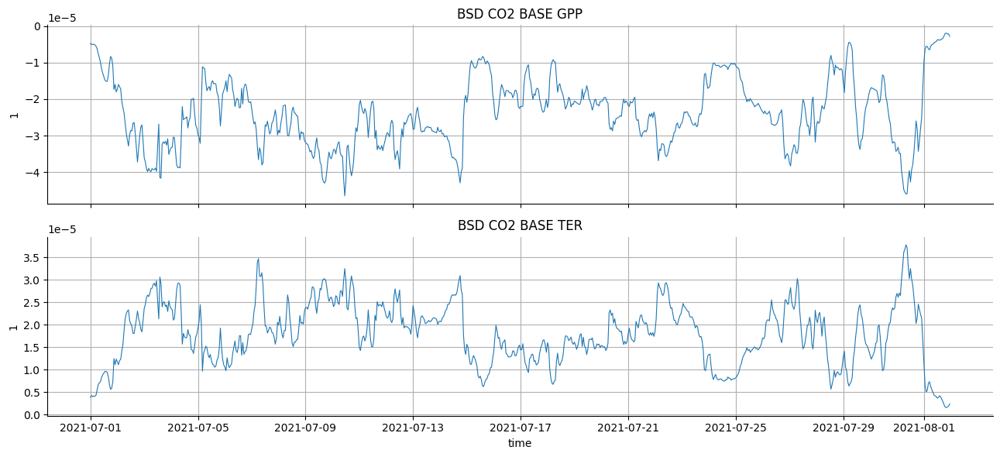

#+PROPERTY: header-args:jupyter-python :kernel verification-games :session /jpy:localhost#8888:forward-plotting :async yes

#+begin_src elisp
(setq-local org-image-actual-width '(900))
(setq jupyter-repl-maximum-output 5000)
#+end_src

#+RESULTS:
: 5000

#+begin_src jupyter-python
%load_ext autoreload
%autoreload 2
#+end_src

#+RESULTS:

* Catalog search

...forgot data is not catalogued yet

#+begin_src jupyter-python
from pathlib import Path
from ogcat import Catalog

VG_PATH = Path("/group/chem/acrg/verification_games_round_2")
CATALOG_PATH = VG_PATH / "games_catalog"

games_cat = Catalog.open(CATALOG_PATH)
#+end_src

#+RESULTS:

#+begin_src jupyter-python
bsd_res = games_cat.search(where={"user_metadata.site": "bsd"}, ignore_case=True, as_record_set=True)
print(len(bsd_res))
#+end_src

#+RESULTS:
: 0

* Forward-model output checks
:PROPERTIES:
:CUSTOM_ID: forward-model-output-checks
:END:
This notebook inspects the modelled pollution event intermediates written
by the production pipeline. It starts with =BSD= because that site has
several processed months and one known missing footprint month.

#+begin_src jupyter-python
import json
from pathlib import Path

import matplotlib.pyplot as plt
import numpy as np
import pandas as pd
import xarray as xr

plt.rcParams.update(
    {
        "figure.figsize": (12, 4),
        "axes.grid": True,
        "axes.spines.top": False,
        "axes.spines.right": False,
    }
)
#+end_src

#+RESULTS:

#+begin_src jupyter-python
VG_PATH = Path("/group/chem/acrg/verification_games_round_2")
WORK_ROOT = VG_PATH / "forward_model_intermediates"
FP_DOT_FLUX_OUTPUT_DIR = WORK_ROOT / "fp_dot_flux"

SITE = "BSD"
SITE_DIR = FP_DOT_FLUX_OUTPUT_DIR / SITE.lower()
FP_DOT_FLUX_VARIABLE = "fp_dot_flux"
#+end_src

#+RESULTS:

** Available BSD outputs
:PROPERTIES:
:CUSTOM_ID: available-bsd-outputs
:END:

#+begin_src jupyter-python
def fp_dot_flux_paths(site=SITE):
    site_dir = FP_DOT_FLUX_OUTPUT_DIR / site.lower()
    return sorted(site_dir.glob(f"{site.lower()}_*_fp_dot_flux.zarr"))

def manifest_paths(site=SITE):
    site_dir = FP_DOT_FLUX_OUTPUT_DIR / site.lower()
    return sorted(site_dir.glob(f"{site.lower()}_*_fp_dot_flux.manifest.json"))

def read_manifests(site=SITE):
    records = []
    for path in manifest_paths(site):
        try:
            record = json.loads(path.read_text())
        except json.JSONDecodeError as exc:
            record = {
                "site": site.upper(),
                "status": "invalid_manifest",
                "error_type": type(exc).__name__,
                "error_message": str(exc),
            }
        record["manifest_path"] = str(path)
        records.append(record)
    if not records:
        return pd.DataFrame()
    return pd.DataFrame(records).sort_values(["site", "start_date"], na_position="last")

paths = fp_dot_flux_paths(SITE)
manifest_df = read_manifests(SITE)

print(f"{SITE} Zarr outputs:", len(paths))
for path in paths:
    print(path.name)

if manifest_df.empty:
    print("No manifests found.")
else:
    cols_to_print = [
        "site",
        "start_date",
        "end_date",
        "status",
        "error_type",
        "error_message",
        "output_path",
    ]
    cols_to_print = [c for c in cols_to_print if c in manifest_df.columns]
    print(manifest_df[cols_to_print])
#+end_src

#+RESULTS:
#+begin_example
BSD Zarr outputs: 8
bsd_202101_fp_dot_flux.zarr
bsd_202102_fp_dot_flux.zarr
bsd_202103_fp_dot_flux.zarr
bsd_202104_fp_dot_flux.zarr
bsd_202105_fp_dot_flux.zarr
bsd_202106_fp_dot_flux.zarr
bsd_202107_fp_dot_flux.zarr
bsd_202108_fp_dot_flux.zarr
  site  start_date    end_date   status  \
0  BSD  2021-01-01  2021-02-01  written
1  BSD  2021-02-01  2021-03-01  written
2  BSD  2021-03-01  2021-04-01  written
3  BSD  2021-04-01  2021-05-01  written
4  BSD  2021-05-01  2021-06-01  written
5  BSD  2021-06-01  2021-07-01  written
6  BSD  2021-07-01  2021-08-01  written
7  BSD  2021-08-01  2021-09-01  written

                                         output_path
0  /group/chem/acrg/verification_games_round_2/fo...
1  /group/chem/acrg/verification_games_round_2/fo...
2  /group/chem/acrg/verification_games_round_2/fo...
3  /group/chem/acrg/verification_games_round_2/fo...
4  /group/chem/acrg/verification_games_round_2/fo...
5  /group/chem/acrg/verification_games_round_2/fo...
6  /group/chem/acrg/verification_games_round_2/fo...
7  /group/chem/acrg/verification_games_round_2/fo...
#+end_example

** Open processed time series
:PROPERTIES:
:CUSTOM_ID: open-processed-time-series
:END:

#+begin_src jupyter-python
def open_site_fp_dot_flux(site=SITE):
    paths = fp_dot_flux_paths(site)
    if not paths:
        raise FileNotFoundError(f"No fp_dot_flux Zarr outputs found for {site}: {SITE_DIR}")

    arrays = []
    for path in paths:
        ds = xr.open_zarr(path, chunks={})
        if FP_DOT_FLUX_VARIABLE not in ds:
            raise KeyError(f"{path} is missing variable {FP_DOT_FLUX_VARIABLE!r}")
        arrays.append(ds[FP_DOT_FLUX_VARIABLE])

    out = xr.concat(arrays, dim="time").sortby("time")
    if "time" in out.dims:
        out = out.chunk({"time": 24 * 7, "source": min(16, out.sizes["source"])})
    return out

bsd_lazy = open_site_fp_dot_flux(SITE)
print(bsd_lazy)

# The site/month outputs are small after summing over lat/lon, so loading
# one site's processed months makes plotting simpler and repeatable.
bsd = bsd_lazy.compute()
print("Loaded:", bsd.sizes)
#+end_src

#+RESULTS:
#+begin_example
<xarray.DataArray 'fp_dot_flux' (time: 5832, source: 48)> Size: 1MB
dask.array<rechunk-merge, shape=(5832, 48), dtype=float32, chunksize=(168, 16), chunktype=numpy.ndarray>
Coordinates:
  ,* time            (time) datetime64[ns] 47kB 2021-01-01 ... 2021-08-31T23:0...
  ,* source          (source) object 384B 'co2_ATEN_GPP' ... 'o2_PTEN_ocean'
    games_scenario  (source) object 384B dask.array<chunksize=(16,), meta=np.ndarray>
    sector          (source) object 384B dask.array<chunksize=(16,), meta=np.ndarray>
    species         (source) object 384B dask.array<chunksize=(16,), meta=np.ndarray>
Attributes: (12/31)
    baseline_status:              not_applied
    description:                  Spatial sum of footprint times staged flux;...
    end_date:                     2021-02-01
    fallback_source:              sib4_co2_gpp
    fallback_source_path:         /group/chem/acrg/verification_games_round_2...
    fallback_source_record_id:    38
    ...                           ...
    source_units_before_staging:  mol m-2 s-1
    source_variable:              flux
    species:                      co2
    start_date:                   2021-01-01
    units:                        1
    version:                      v2
Loaded: Frozen({'time': 5832, 'source': 48})
#+end_example

#+begin_src jupyter-python
time_index = pd.DatetimeIndex(bsd["time"].values)
coverage = pd.Series(1, index=time_index).resample("MS").sum().rename("time_steps")
print(coverage.to_frame())

source_summary = pd.DataFrame(
    {
        "source": bsd["source"].astype(str).values,
        "species": bsd["species"].astype(str).values,
        "scenario": bsd["games_scenario"].astype(str).values,
        "sector": bsd["sector"].astype(str).values,
    }
)
print(source_summary.sort_values(["species", "scenario", "sector"]).reset_index(drop=True))
#+end_src

#+RESULTS:
#+begin_example
            time_steps
2021-01-01         744
2021-02-01         672
2021-03-01         744
2021-04-01         720
2021-05-01         744
2021-06-01         720
2021-07-01         744
2021-08-01         744
            source species scenario sector
0      co2_ATEN_FF     co2     ATEN     FF
1     co2_ATEN_GPP     co2     ATEN    GPP
2     co2_ATEN_TER     co2     ATEN    TER
3   co2_ATEN_ocean     co2     ATEN  ocean
4      co2_BASE_FF     co2     BASE     FF
5     co2_BASE_GPP     co2     BASE    GPP
6     co2_BASE_TER     co2     BASE    TER
7   co2_BASE_ocean     co2     BASE  ocean
8      co2_DFIN_FF     co2     DFIN     FF
9     co2_DFIN_GPP     co2     DFIN    GPP
10    co2_DFIN_TER     co2     DFIN    TER
11  co2_DFIN_ocean     co2     DFIN  ocean
12     co2_HFRA_FF     co2     HFRA     FF
13    co2_HFRA_GPP     co2     HFRA    GPP
14    co2_HFRA_TER     co2     HFRA    TER
15  co2_HFRA_ocean     co2     HFRA  ocean
16     co2_HGER_FF     co2     HGER     FF
17    co2_HGER_GPP     co2     HGER    GPP
18    co2_HGER_TER     co2     HGER    TER
19  co2_HGER_ocean     co2     HGER  ocean
20     co2_PTEN_FF     co2     PTEN     FF
21    co2_PTEN_GPP     co2     PTEN    GPP
22    co2_PTEN_TER     co2     PTEN    TER
23  co2_PTEN_ocean     co2     PTEN  ocean
24      o2_ATEN_FF      o2     ATEN     FF
25     o2_ATEN_GPP      o2     ATEN    GPP
26     o2_ATEN_TER      o2     ATEN    TER
27   o2_ATEN_ocean      o2     ATEN  ocean
28      o2_BASE_FF      o2     BASE     FF
29     o2_BASE_GPP      o2     BASE    GPP
30     o2_BASE_TER      o2     BASE    TER
31   o2_BASE_ocean      o2     BASE  ocean
32      o2_DFIN_FF      o2     DFIN     FF
33     o2_DFIN_GPP      o2     DFIN    GPP
34     o2_DFIN_TER      o2     DFIN    TER
35   o2_DFIN_ocean      o2     DFIN  ocean
36      o2_HFRA_FF      o2     HFRA     FF
37     o2_HFRA_GPP      o2     HFRA    GPP
38     o2_HFRA_TER      o2     HFRA    TER
39   o2_HFRA_ocean      o2     HFRA  ocean
40      o2_HGER_FF      o2     HGER     FF
41     o2_HGER_GPP      o2     HGER    GPP
42     o2_HGER_TER      o2     HGER    TER
43   o2_HGER_ocean      o2     HGER  ocean
44      o2_PTEN_FF      o2     PTEN     FF
45     o2_PTEN_GPP      o2     PTEN    GPP
46     o2_PTEN_TER      o2     PTEN    TER
47   o2_PTEN_ocean      o2     PTEN  ocean
#+end_example

** Plot helpers
:PROPERTIES:
:CUSTOM_ID: plot-helpers
:END:

#+begin_src jupyter-python
def _as_list(values):
    if values is None:
        return None
    if isinstance(values, str):
        return [values]
    return list(values)

def source_mask(da, *, species=None, scenarios=None, sectors=None):
    mask = xr.DataArray(
        np.ones(da.sizes["source"], dtype=bool),
        dims=("source",),
        coords={"source": da["source"]},
    )

    species = _as_list(species)
    scenarios = _as_list(scenarios)
    sectors = _as_list(sectors)

    if species is not None:
        mask = mask & da["species"].astype(str).isin([value.lower() for value in species])
    if scenarios is not None:
        mask = mask & da["games_scenario"].astype(str).isin([value.upper() for value in scenarios])
    if sectors is not None:
        mask = mask & da["sector"].astype(str).isin(sectors)
    return mask

def select_sources(da, *, species=None, scenarios=None, sectors=None):
    mask = source_mask(da, species=species, scenarios=scenarios, sectors=sectors)
    return da.sel(source=da["source"].where(mask, drop=True))

def available_coord_values(da, coord):
    return sorted(pd.unique(da[coord].astype(str).values).tolist())

def scenario_list(da, preferred=("BASE", "DFIN", "ATEN", "TARI", "POST", "PLED")):
    available = set(available_coord_values(da, "games_scenario"))
    return [scenario for scenario in preferred if scenario in available]
#+end_src

#+RESULTS:

** Multi-month biosphere time series
:PROPERTIES:
:CUSTOM_ID: multi-month-biosphere-time-series
:END:

#+begin_src jupyter-python
PLOT_SPECIES = "co2"
PLOT_SCENARIOS = scenario_list(bsd)
BIO_SECTORS = ("GPP", "TER")
units = bsd.attrs.get("units", "1")

fig, axes = plt.subplots(len(BIO_SECTORS), 1, sharex=True, figsize=(13, 7))

for ax, sector in zip(axes, BIO_SECTORS, strict=True):
    for scenario in PLOT_SCENARIOS:
        series = select_sources(
            bsd,
            species=PLOT_SPECIES,
            scenarios=scenario,
            sectors=sector,
        )
        if series.sizes.get("source", 0) == 0:
            continue
        daily = series.sum("source").resample(time="1D").mean()
        ax.plot(
            pd.DatetimeIndex(daily["time"].values),
            daily.values,
            label=scenario,
            linewidth=1.5,
        )
    ax.set_title(f"{SITE} {PLOT_SPECIES.upper()} {sector}: daily mean modelled event")
    ax.set_ylabel(units)
    ax.legend(ncol=3, fontsize=8)

axes[-1].set_xlabel("time")
fig.tight_layout()
plt.show()
#+end_src

#+RESULTS:

#+begin_src jupyter-python
PLOT_SPECIES = "o2"
PLOT_SCENARIOS = scenario_list(bsd)
BIO_SECTORS = ("GPP", "TER")
units = bsd.attrs.get("units", "1")

fig, axes = plt.subplots(len(BIO_SECTORS), 1, sharex=True, figsize=(13, 7))

for ax, sector in zip(axes, BIO_SECTORS, strict=True):
    for scenario in PLOT_SCENARIOS:
        series = select_sources(
            bsd,
            species=PLOT_SPECIES,
            scenarios=scenario,
            sectors=sector,
        )
        if series.sizes.get("source", 0) == 0:
            continue
        daily = series.sum("source").resample(time="1D").mean()
        ax.plot(
            pd.DatetimeIndex(daily["time"].values),
            daily.values,
            label=scenario,
            linewidth=1.5,
        )
    ax.set_title(f"{SITE} {PLOT_SPECIES.upper()} {sector}: daily mean modelled event")
    ax.set_ylabel(units)
    ax.legend(ncol=3, fontsize=8)

axes[-1].set_xlabel("time")
fig.tight_layout()
plt.show()
#+end_src

#+RESULTS:

** Mean diurnal biosphere cycle
:PROPERTIES:
:CUSTOM_ID: mean-diurnal-biosphere-cycle
:END:

#+begin_src jupyter-python
DIURNAL_SPECIES = "co2"
DIURNAL_SCENARIOS = scenario_list(bsd)
DIURNAL_SECTORS = ("GPP", "TER")
units = bsd.attrs.get("units", "1")

fig, axes = plt.subplots(1, len(DIURNAL_SECTORS), sharey=False, figsize=(13, 4))

for ax, sector in zip(axes, DIURNAL_SECTORS, strict=True):
    for scenario in DIURNAL_SCENARIOS:
        series = select_sources(
            bsd,
            species=DIURNAL_SPECIES,
            scenarios=scenario,
            sectors=sector,
        )
        if series.sizes.get("source", 0) == 0:
            continue
        hourly = series.sum("source").groupby("time.hour").mean()
        ax.plot(hourly["hour"].values, hourly.values, marker="o", label=scenario)
    ax.set_title(f"{SITE} {DIURNAL_SPECIES.upper()} {sector}: mean hour-of-day")
    ax.set_xlabel("hour UTC")
    ax.set_ylabel(units)
    ax.set_xticks(np.arange(0, 24, 3))
    ax.legend(ncol=2, fontsize=8)

fig.tight_layout()
plt.show()
#+end_src

#+RESULTS:

#+begin_src jupyter-python
DIURNAL_SPECIES = "o2"
DIURNAL_SCENARIOS = scenario_list(bsd)
DIURNAL_SECTORS = ("GPP", "TER")
units = bsd.attrs.get("units", "1")

fig, axes = plt.subplots(1, len(DIURNAL_SECTORS), sharey=False, figsize=(13, 4))

for ax, sector in zip(axes, DIURNAL_SECTORS, strict=True):
    for scenario in DIURNAL_SCENARIOS:
        series = select_sources(
            bsd,
            species=DIURNAL_SPECIES,
            scenarios=scenario,
            sectors=sector,
        )
        if series.sizes.get("source", 0) == 0:
            continue
        hourly = series.sum("source").groupby("time.hour").mean()
        ax.plot(hourly["hour"].values, hourly.values, marker="o", label=scenario)
    ax.set_title(f"{SITE} {DIURNAL_SPECIES.upper()} {sector}: mean hour-of-day")
    ax.set_xlabel("hour UTC")
    ax.set_ylabel(units)
    ax.set_xticks(np.arange(0, 24, 3))
    ax.legend(ncol=2, fontsize=8)

fig.tight_layout()
plt.show()
#+end_src

#+RESULTS:

** Hourly detail for one month
:PROPERTIES:
:CUSTOM_ID: hourly-detail-for-one-month
:END:
Use this cell to zoom in on the diurnal shape without averaging across
the full available period.

#+begin_src jupyter-python
DETAIL_SPECIES = "co2"
DETAIL_SCENARIO = "BASE"
DETAIL_START = "2021-07-01"
DETAIL_END = "2021-08-01"
DETAIL_SECTORS = ("GPP", "TER")
units = bsd.attrs.get("units", "1")

fig, axes = plt.subplots(len(DETAIL_SECTORS), 1, sharex=True, figsize=(13, 6))

for ax, sector in zip(axes, DETAIL_SECTORS, strict=True):
    series = select_sources(
        bsd,
        species=DETAIL_SPECIES,
        scenarios=DETAIL_SCENARIO,
        sectors=sector,
    )
    if series.sizes.get("source", 0) == 0:
        ax.set_visible(False)
        continue
    hourly = series.sum("source").sel(time=slice(DETAIL_START, DETAIL_END))
    ax.plot(pd.DatetimeIndex(hourly["time"].values), hourly.values, linewidth=0.8)
    ax.set_title(f"{SITE} {DETAIL_SPECIES.upper()} {DETAIL_SCENARIO} {sector}")
    ax.set_ylabel(units)

axes[-1].set_xlabel("time")
fig.tight_layout()
plt.show()
#+end_src

#+RESULTS:

* Auke's obs

#+begin_src jupyter-python
auke_res = games_cat.search(where={"record_type": "verification_games_obs", "university_abbr": "WUR"}, as_record_set=True)
print(len(auke_res))
#+end_src

#+RESULTS:
: 12

#+begin_src jupyter-python
from pprint import pprint

pprint(auke_res[0])
#+end_src

#+RESULTS:
#+begin_example
CatalogRecord(catalog='games-catalog',
              time_added='2026-05-12T06:27:34Z',
              id='114',
              record_type='verification_games_obs',
              locator=ArtifactLocator(kind='path',
                                      value='/group/chem/acrg/verification_games_round_2/games_catalog/data/verification_games_obs/WUR/CTE_STILT_EUROPE_ATEN_co2_concentrations_2021.nc',
                                      relative_path='data/verification_games_obs/WUR/CTE_STILT_EUROPE_ATEN_co2_concentrations_2021.nc'),
              stored_abspath='/group/chem/acrg/verification_games_round_2/games_catalog/data/verification_games_obs/WUR/CTE_STILT_EUROPE_ATEN_co2_concentrations_2021.nc',
              stored_relpath='data/verification_games_obs/WUR/CTE_STILT_EUROPE_ATEN_co2_concentrations_2021.nc',
              storage_mode='copy',
              original_path='/group/chem/acrg/verification_games_round_2/CTE_STILT_EUROPE_ATEN_co2_monthly_concentrations.nc',
              original_filename='CTE_STILT_EUROPE_ATEN_co2_monthly_concentrations.nc',
              suffixes=['.nc'],
              user_metadata={'domain': 'EUROPE',
                             'flux_product': 'CTE',
                             'footprint_model': 'STILT',
                             'games_scenario': 'ATEN',
                             'species': 'co2',
                             'university_abbr': 'WUR',
                             'year': 2021},
              derived_metadata={'netcdf': {'attrs': {},
                                           'coords': ['platform', 'sector'],
                                           'data_vars': ['FF',
                                                         'GPP',
                                                         'TER',
                                                         'altitude',
                                                         'background',
                                                         'intake_height',
                                                         'latitude',
                                                         'longitude',
                                                         'mf_bc_posterior',
                                                         'mf_bc_prior',
                                                         'mf_observed',
                                                         'mf_posterior',
                                                         'mf_prior',
                                                         'number_of_identifier',
                                                         'ocean',
                                                         'time'],
                                           'dims': {'index': 120424,
                                                    'platform': 56,
                                                    'sector': 5}}},
              naming_metadata={'directory_template': 'verification_games_obs/{university_abbr|}',
                               'filename_template': '{flux_product}_{footprint_model}_{domain}_{games_scenario}_{species}_concentrations_{year}{month|}.nc',
                               'record_schema': 'verification_games_obs',
                               'resolved_directory': 'data/verification_games_obs/WUR',
                               'resolved_filename': 'CTE_STILT_EUROPE_ATEN_co2_concentrations_2021.nc',
                               'storage_relative_path': 'data/verification_games_obs/WUR/CTE_STILT_EUROPE_ATEN_co2_concentrations_2021.nc'})
#+end_example

#+begin_src jupyter-python
auke_base_res = games_cat.search(where={"record_type": "verification_games_obs", "university_abbr": "WUR", "games_scenario": "BASE"}, ignore_case=True, as_record_set=True)
print(len(auke_base_res))
#+end_src

#+RESULTS:
: 2

#+begin_src jupyter-python
pprint(auke_base_res[0])
#+end_src

#+RESULTS:
#+begin_example
CatalogRecord(catalog='games-catalog',
              time_added='2026-05-12T06:27:39Z',
              id='116',
              record_type='verification_games_obs',
              locator=ArtifactLocator(kind='path',
                                      value='/group/chem/acrg/verification_games_round_2/games_catalog/data/verification_games_obs/WUR/CTE_STILT_EUROPE_BASE_co2_concentrations_2021.nc',
                                      relative_path='data/verification_games_obs/WUR/CTE_STILT_EUROPE_BASE_co2_concentrations_2021.nc'),
              stored_abspath='/group/chem/acrg/verification_games_round_2/games_catalog/data/verification_games_obs/WUR/CTE_STILT_EUROPE_BASE_co2_concentrations_2021.nc',
              stored_relpath='data/verification_games_obs/WUR/CTE_STILT_EUROPE_BASE_co2_concentrations_2021.nc',
              storage_mode='copy',
              original_path='/group/chem/acrg/verification_games_round_2/CTE_STILT_EUROPE_BASE_co2_monthly_concentrations.nc',
              original_filename='CTE_STILT_EUROPE_BASE_co2_monthly_concentrations.nc',
              suffixes=['.nc'],
              user_metadata={'domain': 'EUROPE',
                             'flux_product': 'CTE',
                             'footprint_model': 'STILT',
                             'games_scenario': 'BASE',
                             'species': 'co2',
                             'university_abbr': 'WUR',
                             'year': 2021},
              derived_metadata={'netcdf': {'attrs': {},
                                           'coords': ['platform', 'sector'],
                                           'data_vars': ['FF',
                                                         'GPP',
                                                         'TER',
                                                         'altitude',
                                                         'background',
                                                         'intake_height',
                                                         'latitude',
                                                         'longitude',
                                                         'mf_bc_posterior',
                                                         'mf_bc_prior',
                                                         'mf_observed',
                                                         'mf_posterior',
                                                         'mf_prior',
                                                         'number_of_identifier',
                                                         'ocean',
                                                         'time'],
                                           'dims': {'index': 120424,
                                                    'platform': 56,
                                                    'sector': 5}}},
              naming_metadata={'directory_template': 'verification_games_obs/{university_abbr|}',
                               'filename_template': '{flux_product}_{footprint_model}_{domain}_{games_scenario}_{species}_concentrations_{year}{month|}.nc',
                               'record_schema': 'verification_games_obs',
                               'resolved_directory': 'data/verification_games_obs/WUR',
                               'resolved_filename': 'CTE_STILT_EUROPE_BASE_co2_concentrations_2021.nc',
                               'storage_relative_path': 'data/verification_games_obs/WUR/CTE_STILT_EUROPE_BASE_co2_concentrations_2021.nc'})
#+end_example

#+begin_src jupyter-python
auke_base_co2 = xr.open_dataset(auke_base_res[0].locator.value)
print(auke_base_co2)
#+end_src

#+RESULTS:
#+begin_example
<xarray.Dataset> Size: 15MB
Dimensions:               (index: 120424, platform: 56, sector: 5)
Coordinates:
  ,* platform              (platform) <U3 672B 'SSL' 'PDM' 'BRM' ... 'PUI' 'FKL'
  ,* sector                (sector) <U10 200B 'GPP' 'TER' ... 'background'
Dimensions without coordinates: index
Data variables: (12/16)
    time                  (index) datetime64[ns] 963kB ...
    longitude             (index) float32 482kB ...
    latitude              (index) float32 482kB ...
    altitude              (index) float32 482kB ...
    intake_height         (index) <U5 2MB ...
    mf_observed           (index) float64 963kB ...
    ...                    ...
    number_of_identifier  (index) int64 963kB ...
    GPP                   (index) float64 963kB ...
    TER                   (index) float64 963kB ...
    FF                    (index) float64 963kB ...
    ocean                 (index) float64 963kB ...
    background            (index) float64 963kB ...
#+end_example

#+begin_src jupyter-python
print(auke_base_co2.sizes)
#+end_src

#+RESULTS:
: Frozen({'index': 120424, 'platform': 56, 'sector': 5})

#+begin_src jupyter-python
print(auke_base_co2.data_vars)
#+end_src

#+RESULTS:
#+begin_example
Data variables:
    time                  (index) datetime64[ns] 963kB ...
    longitude             (index) float32 482kB ...
    latitude              (index) float32 482kB ...
    altitude              (index) float32 482kB ...
    intake_height         (index) <U5 2MB ...
    mf_observed           (index) float64 963kB ...
    mf_prior              (index) float64 963kB ...
    mf_posterior          (index) float64 963kB ...
    mf_bc_prior           (index) float64 963kB ...
    mf_bc_posterior       (index) float64 963kB ...
    number_of_identifier  (index) int64 963kB ...
    GPP                   (index) float64 963kB ...
    TER                   (index) float64 963kB ...
    FF                    (index) float64 963kB ...
    ocean                 (index) float64 963kB ...
    background            (index) float64 963kB ...
#+end_example

#+begin_src jupyter-python
print(np.unique(auke_base_co2.number_of_identifier))
#+end_src

#+RESULTS:
: [ 0  1  2  3  4  5  6  7  8  9 10 11 12 13 15 16 17 18 19 21 22 23 25 26
:  27 28 29 30 31 32 33 34 35 36 37 38 39 40 41 42 44 45 46 47 48 49 50 51
:  52 53 54 55]

#+begin_src jupyter-python
print(list(auke_base_co2.platform).index("BSD"))
#+end_src

#+RESULTS:
: 30

** Plotting
