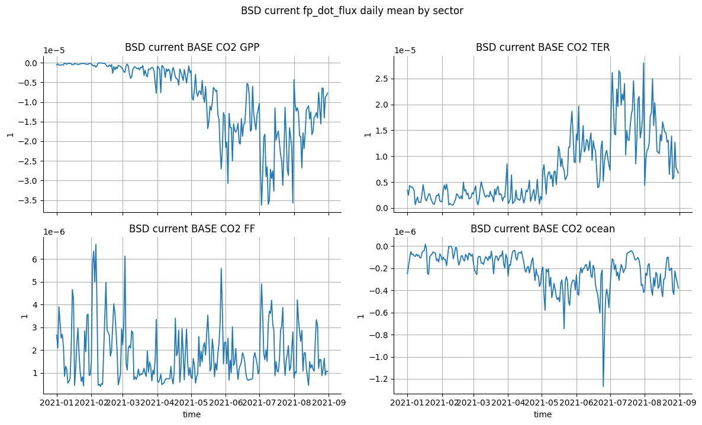
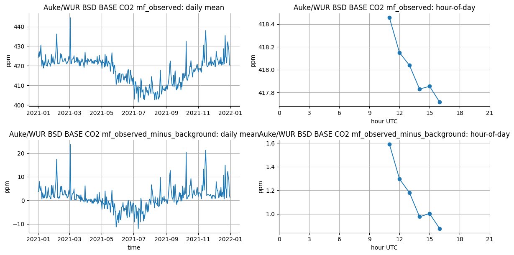
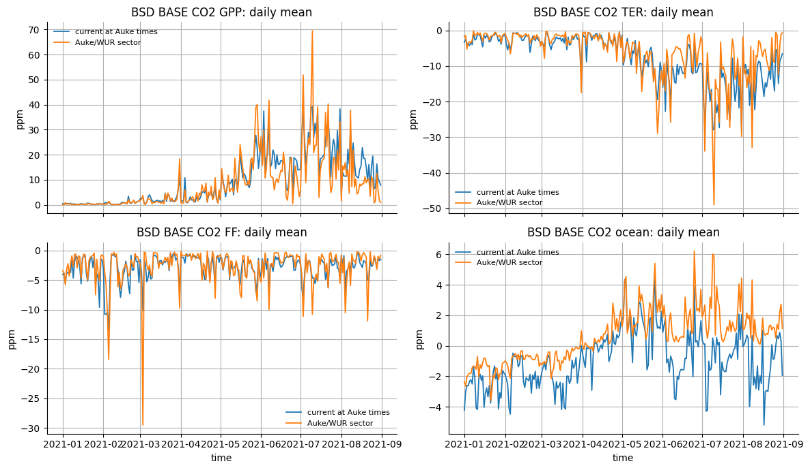
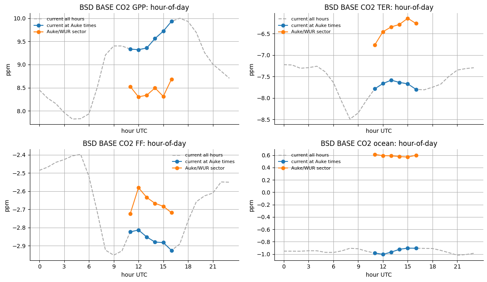

#+PROPERTY: header-args:jupyter-python :kernel verification-games :session /jpy:localhost#8888:forward-plotting-meeting :async yes

#+begin_src elisp
(setq-local org-image-actual-width '(1200))
(setq jupyter-repl-maximum-output 5000)
#+end_src

#+RESULTS:
: 5000

* Forward-model output checks for meeting export
:PROPERTIES:
:CUSTOM_ID: forward-model-output-checks-for-meeting-export
:END:

Focused plots for the current =BSD= forward-model output checks against
Auke/WUR =BASE= data.

** Status
:PROPERTIES:
:CUSTOM_ID: status
:END:

- Current =fp_dot_flux= / modelled pollution event intermediates are still
  being produced.
- For =BSD=, current =fp_dot_flux= outputs are available for January-August
  2021. Later missing-footprint months are logged as failed manifests, not as
  final science conclusions.
- Current production settings: =time_chunk=24=, =PRODUCTION_SOURCE_CHUNK=8=.
  The staged flux is chunked by =source=4=, and earlier smoke/comparison runs
  used =source_chunk=4=. Full staged-flux persist is off
  (=PERSIST_STAGED_FLUX=False=).
- Boundary-condition =modelled_baseline= intermediates are being prepared in a
  separate notebook. The comparisons below therefore use
  =mf_observed_minus_background= where possible.

** Setup
:PROPERTIES:
:CUSTOM_ID: setup
:END:

#+begin_src jupyter-python
import json
from pathlib import Path

from IPython.display import display
from ogcat import Catalog
import matplotlib.pyplot as plt
import numpy as np
import pandas as pd
import xarray as xr

plt.rcParams.update(
    {
        "figure.figsize": (11, 4),
        "axes.grid": True,
        "axes.spines.top": False,
        "axes.spines.right": False,
        "legend.frameon": False,
    }
)
#+end_src

#+RESULTS:

#+begin_src jupyter-python
VG_PATH = Path("/group/chem/acrg/verification_games_round_2")
CATALOG_PATH = VG_PATH / "games_catalog"
WORK_ROOT = VG_PATH / "forward_model_intermediates"
FP_DOT_FLUX_OUTPUT_DIR = WORK_ROOT / "fp_dot_flux"

SITE = "BSD"
AUKE_SITE = "BSD"
AUKE_IDENTIFIER = 30
AUKE_SCENARIO = "BASE"
FP_DOT_FLUX_VARIABLE = "fp_dot_flux"

games_cat = Catalog.open(CATALOG_PATH)
#+end_src

#+RESULTS:

** Load current BSD outputs
:PROPERTIES:
:CUSTOM_ID: load-current-bsd-outputs
:END:

#+begin_src jupyter-python
def fp_dot_flux_paths(site=SITE):
    site_dir = FP_DOT_FLUX_OUTPUT_DIR / site.lower()
    return sorted(site_dir.glob(f"{site.lower()}_*_fp_dot_flux.zarr"))

def manifest_paths(site=SITE):
    site_dir = FP_DOT_FLUX_OUTPUT_DIR / site.lower()
    return sorted(site_dir.glob(f"{site.lower()}_*_fp_dot_flux.manifest.json"))

def read_manifests(site=SITE):
    records = []
    for path in manifest_paths(site):
        try:
            record = json.loads(path.read_text())
        except json.JSONDecodeError as exc:
            record = {
                "site": site.upper(),
                "status": "invalid_manifest",
                "error_type": type(exc).__name__,
                "error_message": str(exc),
            }
        record["manifest_path"] = str(path)
        records.append(record)
    if not records:
        return pd.DataFrame()
    sort_cols = [col for col in ["site", "start_date"] if col in records[0]]
    return pd.DataFrame(records).sort_values(sort_cols, na_position="last")

def open_site_fp_dot_flux(site=SITE):
    paths = fp_dot_flux_paths(site)
    if not paths:
        site_dir = FP_DOT_FLUX_OUTPUT_DIR / site.lower()
        raise FileNotFoundError(f"No fp_dot_flux Zarr outputs found for {site}: {site_dir}")

    arrays = []
    for path in paths:
        ds = xr.open_zarr(path, chunks={})
        if FP_DOT_FLUX_VARIABLE not in ds:
            raise KeyError(f"{path} is missing variable {FP_DOT_FLUX_VARIABLE!r}")
        arrays.append(ds[FP_DOT_FLUX_VARIABLE])

    out = xr.concat(arrays, dim="time").sortby("time")
    return out.chunk({"time": 24 * 7, "source": min(16, out.sizes["source"])})

bsd_paths = fp_dot_flux_paths(SITE)
manifest_df = read_manifests(SITE)
bsd = open_site_fp_dot_flux(SITE).compute()

coverage = (
    pd.Series(1, index=pd.DatetimeIndex(bsd["time"].values))
    .resample("MS")
    .sum()
    .rename("time_steps")
    .to_frame()
)

print(f"{SITE} current Zarr outputs: {len(bsd_paths)}")
display(coverage)

if not manifest_df.empty:
    manifest_cols = [
        "site",
        "start_date",
        "end_date",
        "status",
        "error_type",
        "error_message",
    ]
    display(manifest_df[[col for col in manifest_cols if col in manifest_df.columns]])
#+end_src

#+RESULTS:
:RESULTS:
: BSD current Zarr outputs: 8
#+begin_export html

<table border="1" class="dataframe">
  <thead>
    <tr style="text-align: right;">
      <th></th>
      <th>time_steps</th>
    </tr>
  </thead>
  <tbody>
    <tr>
      <th>2021-01-01</th>
      <td>744</td>
    </tr>
    <tr>
      <th>2021-02-01</th>
      <td>672</td>
    </tr>
    <tr>
      <th>2021-03-01</th>
      <td>744</td>
    </tr>
    <tr>
      <th>2021-04-01</th>
      <td>720</td>
    </tr>
    <tr>
      <th>2021-05-01</th>
      <td>744</td>
    </tr>
    <tr>
      <th>2021-06-01</th>
      <td>720</td>
    </tr>
    <tr>
      <th>2021-07-01</th>
      <td>744</td>
    </tr>
    <tr>
      <th>2021-08-01</th>
      <td>744</td>
    </tr>
  </tbody>
</table>

#+end_export
#+begin_export html

<table border="1" class="dataframe">
  <thead>
    <tr style="text-align: right;">
      <th></th>
      <th>site</th>
      <th>start_date</th>
      <th>end_date</th>
      <th>status</th>
      <th>error_type</th>
      <th>error_message</th>
    </tr>
  </thead>
  <tbody>
    <tr>
      <th>0</th>
      <td>BSD</td>
      <td>2021-01-01</td>
      <td>2021-02-01</td>
      <td>written</td>
      <td>NaN</td>
      <td>NaN</td>
    </tr>
    <tr>
      <th>1</th>
      <td>BSD</td>
      <td>2021-02-01</td>
      <td>2021-03-01</td>
      <td>written</td>
      <td>NaN</td>
      <td>NaN</td>
    </tr>
    <tr>
      <th>2</th>
      <td>BSD</td>
      <td>2021-03-01</td>
      <td>2021-04-01</td>
      <td>written</td>
      <td>NaN</td>
      <td>NaN</td>
    </tr>
    <tr>
      <th>3</th>
      <td>BSD</td>
      <td>2021-04-01</td>
      <td>2021-05-01</td>
      <td>written</td>
      <td>NaN</td>
      <td>NaN</td>
    </tr>
    <tr>
      <th>4</th>
      <td>BSD</td>
      <td>2021-05-01</td>
      <td>2021-06-01</td>
      <td>written</td>
      <td>NaN</td>
      <td>NaN</td>
    </tr>
    <tr>
      <th>5</th>
      <td>BSD</td>
      <td>2021-06-01</td>
      <td>2021-07-01</td>
      <td>written</td>
      <td>NaN</td>
      <td>NaN</td>
    </tr>
    <tr>
      <th>6</th>
      <td>BSD</td>
      <td>2021-07-01</td>
      <td>2021-08-01</td>
      <td>written</td>
      <td>NaN</td>
      <td>NaN</td>
    </tr>
    <tr>
      <th>7</th>
      <td>BSD</td>
      <td>2021-08-01</td>
      <td>2021-09-01</td>
      <td>written</td>
      <td>NaN</td>
      <td>NaN</td>
    </tr>
    <tr>
      <th>8</th>
      <td>BSD</td>
      <td>2021-09-01</td>
      <td>2021-10-01</td>
      <td>failed</td>
      <td>SearchError</td>
      <td>Unable to find results for site='bsd', domain=...</td>
    </tr>
    <tr>
      <th>9</th>
      <td>BSD</td>
      <td>2021-10-01</td>
      <td>2021-11-01</td>
      <td>failed</td>
      <td>SearchError</td>
      <td>Unable to find results for site='bsd', domain=...</td>
    </tr>
    <tr>
      <th>10</th>
      <td>BSD</td>
      <td>2021-11-01</td>
      <td>2021-12-01</td>
      <td>failed</td>
      <td>SearchError</td>
      <td>Unable to find results for site='bsd', domain=...</td>
    </tr>
    <tr>
      <th>11</th>
      <td>BSD</td>
      <td>2021-12-01</td>
      <td>2022-01-01</td>
      <td>failed</td>
      <td>SearchError</td>
      <td>Unable to find results for site='bsd', domain=...</td>
    </tr>
  </tbody>
</table>

#+end_export
:END:

#+begin_src jupyter-python
def _as_list(values):
    if values is None:
        return None
    if isinstance(values, str):
        return [values]
    return list(values)

def source_mask(da, *, species=None, scenarios=None, sectors=None):
    mask = xr.DataArray(
        np.ones(da.sizes["source"], dtype=bool),
        dims=("source",),
        coords={"source": da["source"]},
    )

    species = _as_list(species)
    scenarios = _as_list(scenarios)
    sectors = _as_list(sectors)

    if species is not None:
        mask = mask & da["species"].astype(str).isin([value.lower() for value in species])
    if scenarios is not None:
        mask = mask & da["games_scenario"].astype(str).isin([value.upper() for value in scenarios])
    if sectors is not None:
        mask = mask & da["sector"].astype(str).isin(sectors)
    return mask

def select_sources(da, *, species=None, scenarios=None, sectors=None):
    mask = source_mask(da, species=species, scenarios=scenarios, sectors=sectors)
    return da.sel(source=da["source"].where(mask, drop=True))

def current_base_sector(species, sector):
    selected = select_sources(
        bsd,
        species=species,
        scenarios=AUKE_SCENARIO,
        sectors=sector,
    )
    if selected.sizes.get("source", 0) == 0:
        return None
    return selected.sum("source")

def current_base_total(species, sectors=("GPP", "TER", "FF", "ocean")):
    selected = select_sources(
        bsd,
        species=species,
        scenarios=AUKE_SCENARIO,
        sectors=sectors,
    )
    if selected.sizes.get("source", 0) == 0:
        return None
    return selected.sum("source")
#+end_src

#+RESULTS:

** Load Auke/WUR BASE data
:PROPERTIES:
:CUSTOM_ID: load-aukewur-base-data
:END:

#+begin_src jupyter-python
def open_auke_base_records():
    records = games_cat.search(
        where={
            "record_type": "verification_games_obs",
            "university_abbr": "WUR",
            "games_scenario": AUKE_SCENARIO,
        },
        ignore_case=True,
        as_record_set=True,
    )
    return {record.user_metadata["species"].lower(): record for record in records}

def open_auke_species_dataset(species):
    record = auke_base_records[species.lower()]
    return xr.open_dataset(record.locator.value)

def select_auke_site(ds, *, identifier=AUKE_IDENTIFIER):
    site = ds.where(ds["number_of_identifier"] == identifier, drop=True)
    site = site.assign_coords(time=("index", pd.DatetimeIndex(site["time"].values)))
    return site.swap_dims({"index": "time"}).sortby("time")

def add_auke_enhancement_variables(ds):
    ds = ds.copy()
    if "mf_observed" in ds and "background" in ds:
        ds["mf_observed_minus_background"] = ds["mf_observed"] - ds["background"]
        ds["mf_observed_minus_background"].attrs.update(
            {
                "long_name": "mf_observed minus background",
                "units": ds["mf_observed"].attrs.get("units", ""),
            }
        )
    return ds

auke_base_records = open_auke_base_records()
auke_base = {
    species: add_auke_enhancement_variables(select_auke_site(open_auke_species_dataset(species)))
    for species in sorted(auke_base_records)
}

auke_summary = pd.DataFrame(
    [
        {
            "species": species,
            "time_steps": ds.sizes["time"],
            "start": pd.Timestamp(ds["time"].min().values),
            "end": pd.Timestamp(ds["time"].max().values),
            "platform_code": int(AUKE_IDENTIFIER),
            "platform": str(ds["platform"].isel(platform=AUKE_IDENTIFIER).values),
        }
        for species, ds in auke_base.items()
    ]
)
display(auke_summary)
#+end_src

#+RESULTS:
#+begin_export html

<table border="1" class="dataframe">
  <thead>
    <tr style="text-align: right;">
      <th></th>
      <th>species</th>
      <th>time_steps</th>
      <th>start</th>
      <th>end</th>
      <th>platform_code</th>
      <th>platform</th>
    </tr>
  </thead>
  <tbody>
    <tr>
      <th>0</th>
      <td>co2</td>
      <td>2190</td>
      <td>2021-01-01 11:00:00</td>
      <td>2021-12-31 16:00:00</td>
      <td>30</td>
      <td>BSD</td>
    </tr>
    <tr>
      <th>1</th>
      <td>o2</td>
      <td>2190</td>
      <td>2021-01-01 11:00:00</td>
      <td>2021-12-31 16:00:00</td>
      <td>30</td>
      <td>BSD</td>
    </tr>
  </tbody>
</table>

#+end_export

#+begin_src jupyter-python
AUKE_MF_VARIABLES = ("mf_observed", "mf_observed_minus_background")
AUKE_SECTOR_VARIABLES = ("GPP", "TER", "FF", "ocean")

def auke_series(species, variable):
    if species not in auke_base or variable not in auke_base[species]:
        return None
    return auke_base[species][variable].reset_coords(drop=True)

def scale_current_to_auke_units(current, auke_variable):
    units = str(auke_variable.attrs.get("units", "")).strip()
    unit_key = units.lower().replace("µ", "u")
    if unit_key in {"ppm", "umol mol-1", "micromol mol-1", "1e-6"}:
        scaled = current * 1.0e6
    elif unit_key in {"ppb", "nmol mol-1", "nanomol mol-1", "1e-9"}:
        scaled = current * 1.0e9
    else:
        scaled = current
    scaled.attrs["units"] = units or current.attrs.get("units", "")
    return scaled

def compare_current_to_auke_variable(species, variable):
    current = current_base_total(species)
    auke = auke_series(species, variable)
    if current is None or auke is None:
        return None
    current = scale_current_to_auke_units(current, auke)
    current_at_auke_times, auke_at_times = xr.align(current, auke, join="inner")
    return xr.Dataset(
        {"current": current_at_auke_times, "auke": auke_at_times}
    ).assign_attrs({"units": auke.attrs.get("units", current.attrs.get("units", ""))})

def compare_sector_at_auke_times(species, sector):
    current = current_base_sector(species, sector)
    auke = auke_series(species, sector)
    if current is None or auke is None:
        return None
    current = scale_current_to_auke_units(current, auke)
    current_at_auke_times, auke_at_times = xr.align(current, auke, join="inner")
    return xr.Dataset(
        {"current": current_at_auke_times, "auke": auke_at_times}
    ).assign_attrs({"units": auke.attrs.get("units", current.attrs.get("units", ""))})
#+end_src

#+RESULTS:

** BSD current BASE CO2 sector daily means
:PROPERTIES:
:CUSTOM_ID: bsd-current-base-co2-sector-daily-means
:END:

#+begin_src jupyter-python
PLOT_SPECIES = "co2"
PLOT_SECTORS = ("GPP", "TER", "FF", "ocean")
units = bsd.attrs.get("units", "1")

fig, axes = plt.subplots(2, 2, sharex=True, figsize=(12, 7))
axes = axes.ravel()

for ax, sector in zip(axes, PLOT_SECTORS, strict=True):
    current = current_base_sector(PLOT_SPECIES, sector)
    if current is None:
        ax.set_visible(False)
        continue
    daily = current.resample(time="1D").mean()
    ax.plot(pd.DatetimeIndex(daily["time"].values), daily.values, linewidth=1.3)
    ax.set_title(f"{SITE} current {AUKE_SCENARIO} {PLOT_SPECIES.upper()} {sector}")
    ax.set_ylabel(units)

for ax in axes[-2:]:
    ax.set_xlabel("time")

fig.suptitle("BSD current fp_dot_flux daily mean by sector", y=1.02)
fig.tight_layout()
plt.show()
#+end_src

#+RESULTS:
:RESULTS:
#+attr_org: :width 1186

:END:

** Auke/WUR BASE CO2 observed signal
:PROPERTIES:
:CUSTOM_ID: aukewur-base-co2-observed-signal
:END:

#+begin_src jupyter-python
PLOT_SPECIES = "co2"
variables = [name for name in AUKE_MF_VARIABLES if name in auke_base[PLOT_SPECIES]]

fig, axes = plt.subplots(len(variables), 2, figsize=(12, 3.1 * len(variables)))
axes = np.atleast_2d(axes)

for row, name in enumerate(variables):
    series = auke_series(PLOT_SPECIES, name)
    units = series.attrs.get("units", "")

    daily = series.resample(time="1D").mean()
    axes[row, 0].plot(pd.DatetimeIndex(daily["time"].values), daily.values, linewidth=1.3)
    axes[row, 0].set_title(f"Auke/WUR {AUKE_SITE} {AUKE_SCENARIO} CO2 {name}: daily mean")
    axes[row, 0].set_ylabel(units)

    hourly = series.groupby("time.hour").mean()
    axes[row, 1].plot(hourly["hour"].values, hourly.values, marker="o", linewidth=1.3)
    axes[row, 1].set_title(f"Auke/WUR {AUKE_SITE} {AUKE_SCENARIO} CO2 {name}: hour-of-day")
    axes[row, 1].set_xlabel("hour UTC")
    axes[row, 1].set_ylabel(units)
    axes[row, 1].set_xticks(np.arange(0, 24, 3))

axes[-1, 0].set_xlabel("time")
fig.tight_layout()
plt.show()
#+end_src

#+RESULTS:

** Current vs Auke observed-minus-background
:PROPERTIES:
:CUSTOM_ID: current-vs-auke-observed-minus-background
:END:

Raw =mf_observed= includes the background term. Current =fp_dot_flux= output
does not include the baseline term, so this comparison uses
=mf_observed_minus_background= and aligns to Auke sampled timestamps.

#+begin_src jupyter-python
COMPARE_SPECIES = "co2"
COMPARE_VARIABLE = "mf_observed_minus_background"
comp = compare_current_to_auke_variable(COMPARE_SPECIES, COMPARE_VARIABLE)

fig, axes = plt.subplots(1, 2, figsize=(12, 4))

current_daily = comp["current"].resample(time="1D").mean()
auke_daily = comp["auke"].resample(time="1D").mean()
axes[0].plot(
    pd.DatetimeIndex(current_daily["time"].values),
    current_daily.values,
    label="current fp_dot_flux at Auke times",
    linewidth=1.3,
)
axes[0].plot(
    pd.DatetimeIndex(auke_daily["time"].values),
    auke_daily.values,
    label="Auke/WUR observed - background",
    linewidth=1.3,
)
axes[0].set_title(f"{AUKE_SITE} {AUKE_SCENARIO} CO2 daily mean")
axes[0].set_xlabel("time")
axes[0].set_ylabel(comp.attrs.get("units", ""))
axes[0].legend(fontsize=8)

current_hourly = comp["current"].groupby("time.hour").mean()
auke_hourly = comp["auke"].groupby("time.hour").mean()
axes[1].plot(current_hourly["hour"].values, current_hourly.values, marker="o", label="current fp_dot_flux")
axes[1].plot(auke_hourly["hour"].values, auke_hourly.values, marker="o", label="Auke/WUR observed - background")
axes[1].set_title(f"{AUKE_SITE} {AUKE_SCENARIO} CO2 hour-of-day")
axes[1].set_xlabel("hour UTC")
axes[1].set_ylabel(comp.attrs.get("units", ""))
axes[1].set_xticks(np.arange(0, 24, 3))
axes[1].legend(fontsize=8)

fig.tight_layout()
plt.show()
#+end_src

** Sector comparison at Auke sampled timestamps
:PROPERTIES:
:CUSTOM_ID: sector-comparison-at-auke-sampled-timestamps
:END:

Auke/WUR =BSD= samples appear concentrated around 10:00-16:00 UTC. The sector
comparisons align current hourly output to those sampled timestamps before
aggregation.

#+begin_src jupyter-python
sample_hours = (
    pd.Series(pd.DatetimeIndex(auke_base["co2"]["time"].values).hour, name="hour")
    .value_counts()
    .sort_index()
    .rename_axis("hour_utc")
    .to_frame("samples")
)
display(sample_hours)
#+end_src

#+RESULTS:
#+begin_export html

<table border="1" class="dataframe">
  <thead>
    <tr style="text-align: right;">
      <th></th>
      <th>samples</th>
    </tr>
    <tr>
      <th>hour_utc</th>
      <th></th>
    </tr>
  </thead>
  <tbody>
    <tr>
      <th>11</th>
      <td>365</td>
    </tr>
    <tr>
      <th>12</th>
      <td>365</td>
    </tr>
    <tr>
      <th>13</th>
      <td>365</td>
    </tr>
    <tr>
      <th>14</th>
      <td>365</td>
    </tr>
    <tr>
      <th>15</th>
      <td>365</td>
    </tr>
    <tr>
      <th>16</th>
      <td>365</td>
    </tr>
  </tbody>
</table>

#+end_export

#+begin_src jupyter-python
SECTOR_COMPARE_SPECIES = "o2"
available_sectors = [
    sector
    for sector in AUKE_SECTOR_VARIABLES
    if compare_sector_at_auke_times(SECTOR_COMPARE_SPECIES, sector) is not None
]

fig, axes = plt.subplots(2, 2, sharex=True, figsize=(12, 7))
axes = axes.ravel()

for ax, sector in zip(axes, available_sectors, strict=False):
    comp = compare_sector_at_auke_times(SECTOR_COMPARE_SPECIES, sector)
    current_daily = comp["current"].resample(time="1D").mean()
    auke_daily = comp["auke"].resample(time="1D").mean()

    ax.plot(
        pd.DatetimeIndex(current_daily["time"].values),
        current_daily.values,
        label="current at Auke times",
        linewidth=1.3,
    )
    ax.plot(
        pd.DatetimeIndex(auke_daily["time"].values),
        auke_daily.values,
        label="Auke/WUR sector",
        linewidth=1.3,
    )
    ax.set_title(f"{AUKE_SITE} {AUKE_SCENARIO} CO2 {sector}: daily mean")
    ax.set_ylabel(comp.attrs.get("units", ""))
    ax.legend(fontsize=8)

for ax in axes[len(available_sectors):]:
    ax.set_visible(False)
for ax in axes[-2:]:
    ax.set_xlabel("time")

fig.tight_layout()
plt.show()
#+end_src

#+RESULTS:
:RESULTS:
#+attr_org: :width 1186

:END:

#+begin_src jupyter-python
fig, axes = plt.subplots(2, 2, sharex=True, figsize=(12, 7))
axes = axes.ravel()

for ax, sector in zip(axes, available_sectors, strict=False):
    comp = compare_sector_at_auke_times(SECTOR_COMPARE_SPECIES, sector)
    current_full = scale_current_to_auke_units(
        current_base_sector(SECTOR_COMPARE_SPECIES, sector),
        auke_series(SECTOR_COMPARE_SPECIES, sector),
    )
    current_full_hourly = current_full.groupby("time.hour").mean()
    current_sampled_hourly = comp["current"].groupby("time.hour").mean()
    auke_hourly = comp["auke"].groupby("time.hour").mean()

    ax.plot(
        current_full_hourly["hour"].values,
        current_full_hourly.values,
        color="0.65",
        linestyle="--",
        label="current all hours",
    )
    ax.plot(
        current_sampled_hourly["hour"].values,
        current_sampled_hourly.values,
        marker="o",
        label="current at Auke times",
    )
    ax.plot(
        auke_hourly["hour"].values,
        auke_hourly.values,
        marker="o",
        label="Auke/WUR sector",
    )
    ax.set_title(f"{AUKE_SITE} {AUKE_SCENARIO} CO2 {sector}: hour-of-day")
    ax.set_xlabel("hour UTC")
    ax.set_ylabel(comp.attrs.get("units", ""))
    ax.set_xticks(np.arange(0, 24, 3))
    ax.legend(fontsize=8)

for ax in axes[len(available_sectors):]:
    ax.set_visible(False)

fig.tight_layout()
plt.show()
#+end_src

#+RESULTS:
:RESULTS:
#+attr_org: :width 1189

:END:
